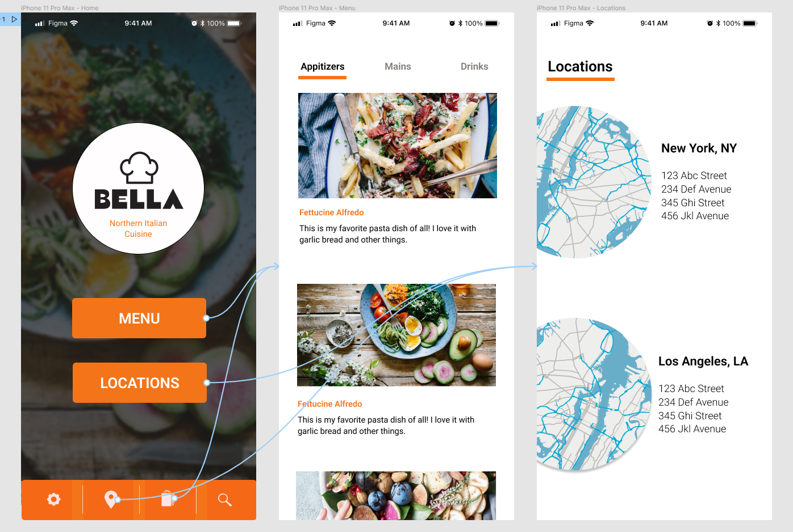
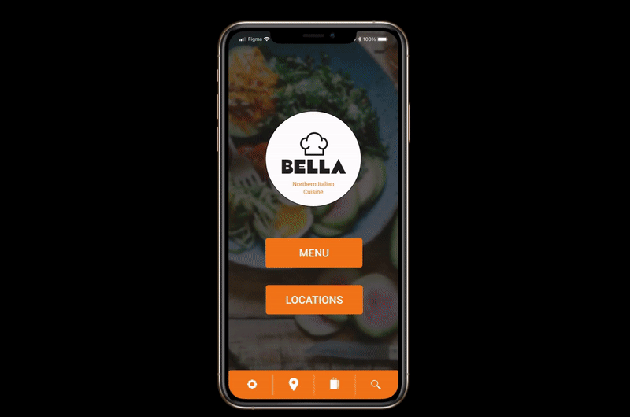

# BasicFigmaTutorial
> This repo contains images that reference Figma Essential Training: The Basics on LinkedIn Learning.
>
> Link : https://www.linkedin.com/learning-login/share?account=75841506&forceAccount=false&redirect=https%3A%2F%2Fwww.linkedin.com%2Flearning%2Ffigma-essential-training-the-basics%3Ftrk%3Dshare_ent_url%26shareId%3DOE%252BOrZOtRbGdFAt8IHsmbQ%253D%253D

<!-- CONTENTS -->
## Contents
* app_screenshot.png (screenshot)
* app_presentation.gif (presentation)
* shopping_bag.svg (icon)
* map.svg (icon)

* neo_app_full.gif (prototype)
* circle.gif (emphasize funtionalities)
* neo-invest.png (investment screenshot)

## Overview

### BasicFigmaTutorial - LinkedIn Learning
| The First Project on Figma! |  
|---------------------|
|  |

|     Map Icon   |    Shopping Bag Icon   |
|--------------------|--------------------|
| | |

| Presentation version (iPhone 11) |
|---------------------|
| |

### Prototype of Neo Financial App - Sprint to Innovate
| Prototype (iPhone 8) |
|---------------------|
| |

| Prototype of Products (iPhone 8) |
|---------------------|
| |

| Prototype of Neo Invest(iPhone 8) |
|---------------------|
| |

<!-- CONTACT -->
## Contact

Sam Lee - [@LinkedIn](https://www.linkedin.com/in/sam-lee-dev/) - LeeSam235711@gmail.com
